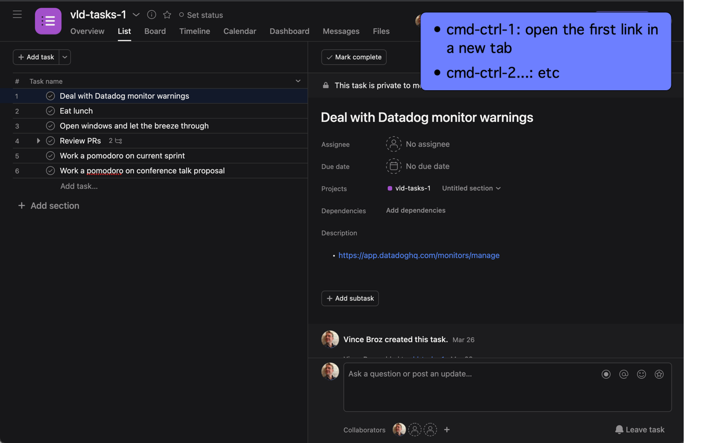
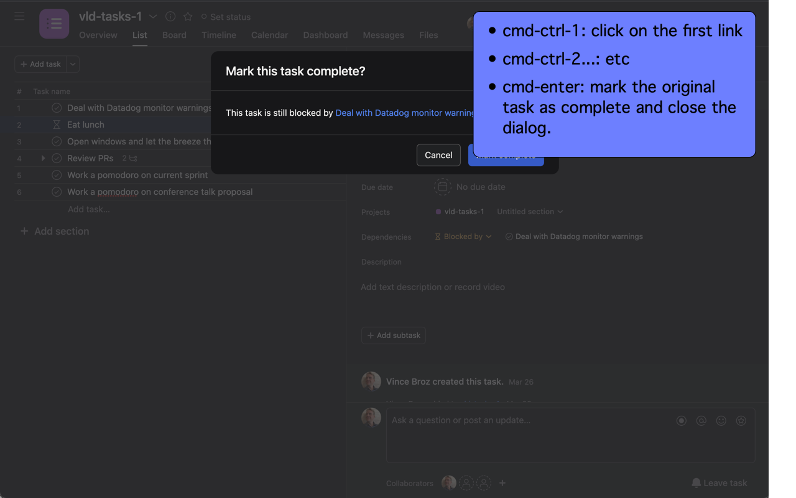

# Shortcuts for Asana

Chrome extension which adds missing keyboard shortcuts/behavior to Asana.

## Using

### Tasks

Remove the assignee of a task using cmd-ctrl-r:

Assign the time of a task with ctrl-t:

### Task List

When you mark a task complete using cmd-enter in the task list view,
Shortcuts for Asana will return your focus to the first open task.

## Search Results

ctrl-r will click the 'Refine search' button.

### Task Description

If you have links within a task description, Shortcuts for Asana adds
keyboard shortcuts for those tasks:

* cmd-ctrl-1: open the first link in a new tab
* cmd-ctrl-2...: etc

### Dependent Task Dialog

If you mark a task done which has dependent tasks, links to those
tasks appear in the warning dialog.  Shortcuts for Asana adds keyboard
shortcuts for those tasks:

* cmd-ctrl-1: click on first task in the dependent task warning dialog.
* cmd-ctrl-2...: etc
* cmd-enter: mark the original task as complete and close the dialog.

(see [Upvoter for
Asana](https://github.com/apiology/upvoter-for-asana) for an
interesting use for these links!)

## Legal

Not created, maintained, reviewed, approved, or endorsed by Asana, Inc.

## Contributions

This project, as with all others, rests on the shoulders of a broad
ecosystem supported by many volunteers doing thankless work, along
with specific contributors.

In particular I'd like to call out:

* [Audrey Roy Greenfeld](https://github.com/audreyfeldroy) for the
  cookiecutter tool and associated examples, which keep my many
  projects building with shared boilerplate with a minimum of fuss.
